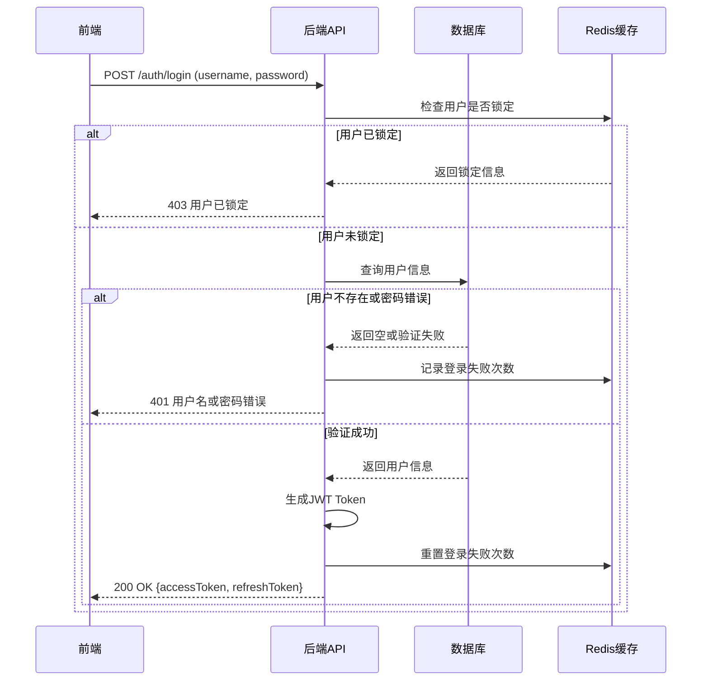
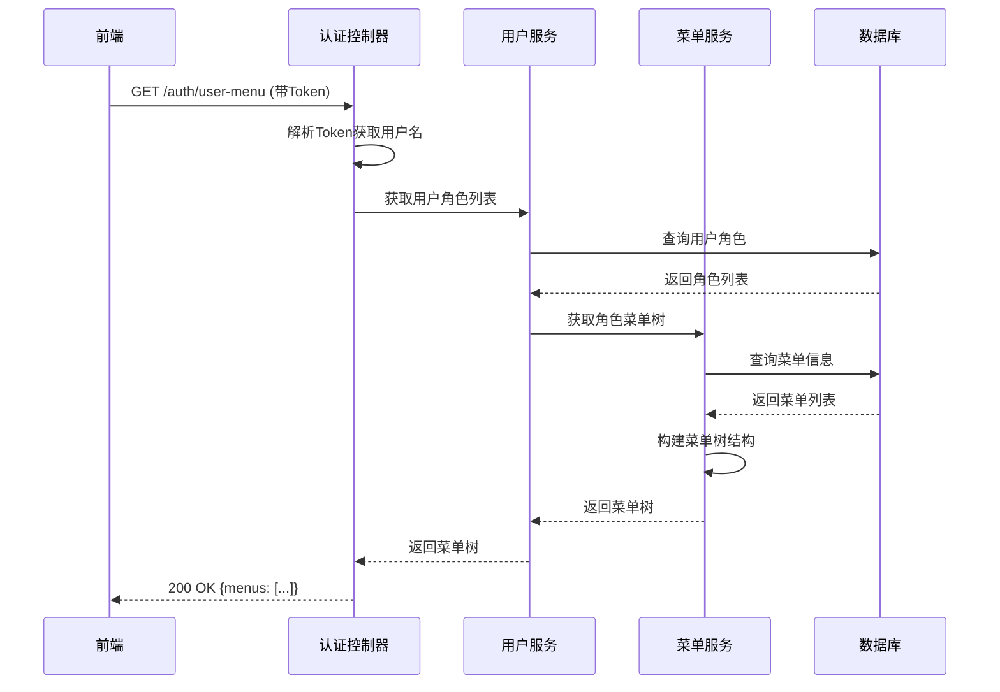

# 登录演示系统详细设计文档

## 1. 系统概述

本系统是一个基于Spring Boot和React的登录演示系统，实现了用户认证、权限管理、菜单管理等核心功能。系统采用前后端分离架构，支持JWT令牌认证、用户角色权限控制、菜单树动态生成等特性。

## 2. 技术栈

### 2.1 后端技术栈

| 技术/框架 | 版本 | 用途 |
|---------|------|------|
| Spring Boot | 2.x | 应用程序框架 |
| MyBatis-Plus | 3.x | ORM框架 |
| MySQL | 8.x | 关系型数据库 |
| Redis | 6.x | 缓存、Session存储、分布式锁 |
| JWT | - | 无状态认证 |
| Swagger | 2.9.2 | API文档 |
| Lombok | 1.18.16 | 减少样板代码 |

### 2.2 前端技术栈

| 技术/框架 | 版本 | 用途 |
|---------|------|------|
| React | 17.0.2 | UI库 |
| Ant Design | 4.16.13 | UI组件库 |
| React Router | - | 前端路由 |
| Axios | 0.24.0 | HTTP客户端 |

## 3. 数据库设计

### 3.1 数据库表结构

#### 3.1.1 `users`表 - 用户信息表

```sql
CREATE TABLE `users` (
  `id` bigint NOT NULL AUTO_INCREMENT,
  `username` varchar(50) NOT NULL COMMENT '用户名',
  `password` varchar(255) NOT NULL COMMENT '密码',
  `email` varchar(100) NOT NULL COMMENT '邮箱',
  `phone` varchar(20) DEFAULT NULL COMMENT '手机号',
  `nickname` varchar(50) DEFAULT NULL COMMENT '昵称',
  `avatar` varchar(255) DEFAULT NULL COMMENT '头像',
  `status` tinyint DEFAULT '1' COMMENT '状态 0:禁用 1:启用',
  `locked` tinyint DEFAULT '0' COMMENT '是否锁定 0:未锁定 1:锁定',
  `login_count` int DEFAULT '0' COMMENT '登录次数',
  `last_login_time` datetime DEFAULT NULL COMMENT '最后登录时间',
  `last_login_ip` varchar(50) DEFAULT NULL COMMENT '最后登录IP',
  `create_time` datetime DEFAULT CURRENT_TIMESTAMP COMMENT '创建时间',
  `update_time` datetime DEFAULT CURRENT_TIMESTAMP ON UPDATE CURRENT_TIMESTAMP COMMENT '更新时间',
  PRIMARY KEY (`id`),
  UNIQUE KEY `idx_username` (`username`),
  UNIQUE KEY `idx_email` (`email`),
  UNIQUE KEY `idx_phone` (`phone`)
) ENGINE=InnoDB AUTO_INCREMENT=2 DEFAULT CHARSET=utf8mb4 COLLATE=utf8mb4_0900_ai_ci;
```

#### 3.1.2 `roles`表 - 角色信息表

```sql
CREATE TABLE `roles` (
  `id` bigint NOT NULL AUTO_INCREMENT,
  `name` varchar(50) NOT NULL COMMENT '角色名称',
  `code` varchar(50) NOT NULL COMMENT '角色编码',
  `description` varchar(255) DEFAULT NULL COMMENT '角色描述',
  `status` tinyint DEFAULT '1' COMMENT '状态 0:禁用 1:启用',
  `create_time` datetime DEFAULT CURRENT_TIMESTAMP COMMENT '创建时间',
  `update_time` datetime DEFAULT CURRENT_TIMESTAMP ON UPDATE CURRENT_TIMESTAMP COMMENT '更新时间',
  PRIMARY KEY (`id`),
  UNIQUE KEY `idx_role_code` (`code`)
) ENGINE=InnoDB DEFAULT CHARSET=utf8mb4 COLLATE=utf8mb4_0900_ai_ci;
```

#### 3.1.3 `user_roles`表 - 用户角色关联表

```sql
CREATE TABLE `user_roles` (
  `id` bigint NOT NULL AUTO_INCREMENT,
  `user_id` bigint NOT NULL COMMENT '用户ID',
  `role_id` bigint NOT NULL COMMENT '角色ID',
  PRIMARY KEY (`id`),
  KEY `idx_user_id` (`user_id`),
  KEY `idx_role_id` (`role_id`)
) ENGINE=InnoDB DEFAULT CHARSET=utf8mb4 COLLATE=utf8mb4_0900_ai_ci;
```

#### 3.1.4 `menus`表 - 菜单信息表

```sql
CREATE TABLE `menus` (
  `id` bigint NOT NULL AUTO_INCREMENT,
  `parent_id` bigint DEFAULT '0' COMMENT '父菜单ID',
  `name` varchar(100) NOT NULL COMMENT '菜单名称',
  `path` varchar(255) DEFAULT NULL COMMENT '菜单路径',
  `component` varchar(255) DEFAULT NULL COMMENT '组件路径',
  `key` varchar(100) NOT NULL COMMENT '菜单唯一标识',
  `type` tinyint NOT NULL COMMENT '菜单类型 0:目录 1:菜单 2:按钮',
  `icon` varchar(50) DEFAULT NULL COMMENT '菜单图标',
  `sort_order` int DEFAULT '0' COMMENT '排序号',
  `hidden` tinyint DEFAULT '0' COMMENT '是否隐藏 0:显示 1:隐藏',
  `status` tinyint DEFAULT '1' COMMENT '状态 0:禁用 1:启用',
  `create_time` datetime DEFAULT CURRENT_TIMESTAMP COMMENT '创建时间',
  `update_time` datetime DEFAULT CURRENT_TIMESTAMP ON UPDATE CURRENT_TIMESTAMP COMMENT '更新时间',
  PRIMARY KEY (`id`),
  KEY `idx_parent_id` (`parent_id`),
  KEY `idx_sort_order` (`sort_order`)
) ENGINE=InnoDB DEFAULT CHARSET=utf8mb4 COLLATE=utf8mb4_0900_ai_ci;
```

#### 3.1.5 `role_menus`表 - 角色菜单关联表

```sql
CREATE TABLE `role_menus` (
  `id` bigint NOT NULL AUTO_INCREMENT,
  `role_id` bigint NOT NULL COMMENT '角色ID',
  `menu_id` bigint NOT NULL COMMENT '菜单ID',
  PRIMARY KEY (`id`),
  KEY `idx_role_id` (`role_id`),
  KEY `idx_menu_id` (`menu_id`)
) ENGINE=InnoDB DEFAULT CHARSET=utf8mb4 COLLATE=utf8mb4_0900_ai_ci;
```

## 4. 系统架构

### 4.1 整体架构

- **前端**: React + Ant Design + React Router
- **后端**: Spring Boot + MyBatis-Plus
- **数据层**: MySQL + Redis
- **认证**: JWT Token

### 4.2 核心流程图

#### 4.2.1 登录流程



#### 4.2.2 菜单获取流程



## 5. 后端功能设计

### 5.1 核心模块

#### 5.1.1 认证模块 (AuthController)

**主要功能**：处理用户认证相关请求，包括注册、登录、获取用户菜单、登出和刷新Token。

**关键接口**：
- `POST /auth/register` - 用户注册
- `POST /auth/login` - 用户登录
- `GET /auth/user-menu` - 获取当前用户菜单
- `POST /auth/logout` - 用户登出
- `POST /auth/refresh-token` - 刷新访问令牌

#### 5.1.2 用户模块 (UserController, UserServiceImpl)

**主要功能**：用户信息管理、用户认证逻辑实现。

**核心方法**：
- `register(RegisterRequest)` - 用户注册逻辑
- `login(LoginRequest)` - 用户登录逻辑，包含密码验证、Token生成、登录失败限制
- `logout(String)` - 用户登出，将Token加入黑名单
- `getUserMenus(String)` - 获取用户可访问的菜单列表
- `checkUserLocked(String)` - 检查用户是否锁定

#### 5.1.3 菜单模块 (MenuController, MenuServiceImpl)

**主要功能**：菜单管理、菜单树构建。

**核心方法**：
- `listAllMenus()` - 获取所有菜单
- `listMenusByRoleIds(List<Long>)` - 根据角色ID列表获取菜单
- `getUserMenuTree(List<Long>)` - 获取用户菜单树
- `buildMenuTree(List<Menu>)` - 构建菜单树结构
- `addChildMenus(Menu, Map<Long, List<Menu>>)` - 递归添加子菜单

### 5.2 工具类

#### 5.2.1 JwtUtils

**主要功能**：JWT令牌的生成、解析和验证。

#### 5.2.2 PasswordUtils

**主要功能**：密码的加密和验证。

#### 5.2.3 RedisUtils

**主要功能**：Redis操作工具类，用于缓存管理、分布式锁等。

## 6. 前端功能设计

### 6.1 核心页面

#### 6.1.1 登录页面 (LoginPage.js)

**主要功能**：用户登录表单、自动登录功能。

**核心功能点**：
- 登录表单验证
- 自动填充默认测试账号
- 登录状态管理
- Token存储

#### 6.1.2 主页面 (MainPage.js)

**主要功能**：系统主界面，包含侧边栏菜单、顶部导航、内容区域。

**核心功能点**：
- 动态菜单加载
- 菜单树构建
- 页面路由切换
- 用户信息展示

#### 6.1.3 用户管理页面 (UsersListPage.js)

**主要功能**：用户列表展示、用户管理操作。

#### 6.1.4 角色管理页面 (RolesListPage.js)

**主要功能**：角色列表展示、角色权限配置。

#### 6.1.5 菜单管理页面 (MenusListPage.js)

**主要功能**：菜单树展示、菜单增删改查。

### 6.2 全局配置

#### 6.2.1 Axios配置 (App.js)

**主要功能**：配置HTTP请求拦截器，处理Token添加、响应错误处理等。

**核心配置**：
- 基础URL设置
- 请求拦截器：添加Authorization头
- 响应拦截器：处理Token过期、统一错误处理

#### 6.2.2 路由配置

**主要功能**：定义系统路由结构，实现页面导航。

**路由列表**：
- `/login` - 登录页
- `/register` - 注册页
- `/` - 主页 (默认重定向到dashboard)
- 其他业务路由 (动态加载)

## 7. 安全设计

### 7.1 认证安全

- JWT令牌认证，支持访问令牌和刷新令牌
- Token过期机制，自动刷新Token
- 登录失败次数限制，超过阈值自动锁定用户
- Token黑名单机制，登出后立即失效

### 7.2 数据安全

- 密码加密存储 (bcrypt)
- 敏感信息传输加密 (HTTPS)
- SQL注入防护 (MyBatis-Plus参数化查询)

## 8. 部署配置

### 8.1 后端配置 (application.yml)

**主要配置项**：
- 服务器端口
- 数据库连接信息
- Redis配置
- JWT配置 (密钥、过期时间)
- 登录失败限制配置

### 8.2 前端配置 (package.json)

**主要配置项**：
- 依赖管理
- 开发服务器配置
- 代理配置

## 9. 总结

本系统是一个基于Spring Boot和React的前后端分离登录演示系统，实现了完整的用户认证、权限管理、菜单管理功能。系统采用JWT无状态认证，支持用户角色权限控制，菜单树动态生成等特性。通过MySQL存储业务数据，Redis缓存临时数据，保证了系统的性能和安全性。

系统架构清晰，模块划分合理，代码结构规范，便于维护和扩展。详细设计文档覆盖了数据库设计、前端页面、后端功能和技术栈使用情况，可以作为系统开发和维护的重要参考。