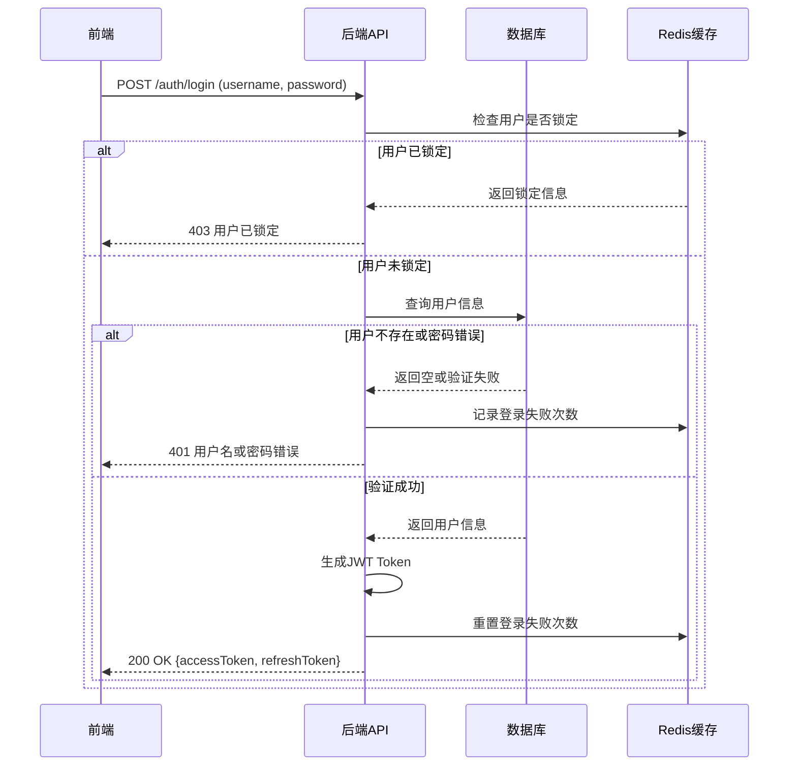
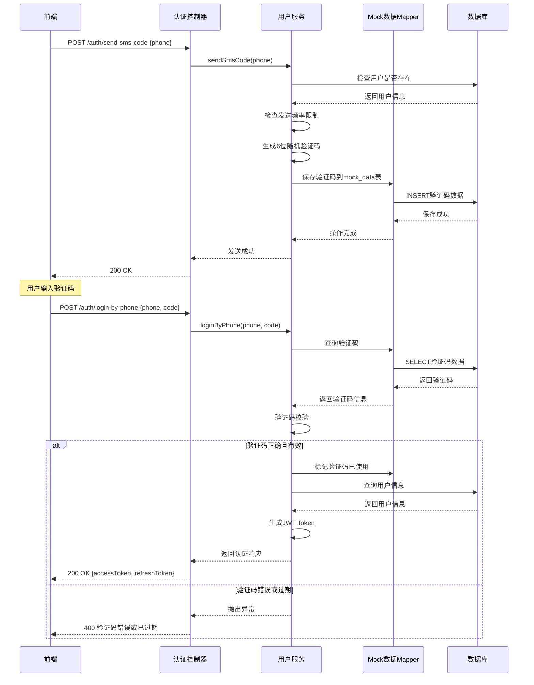
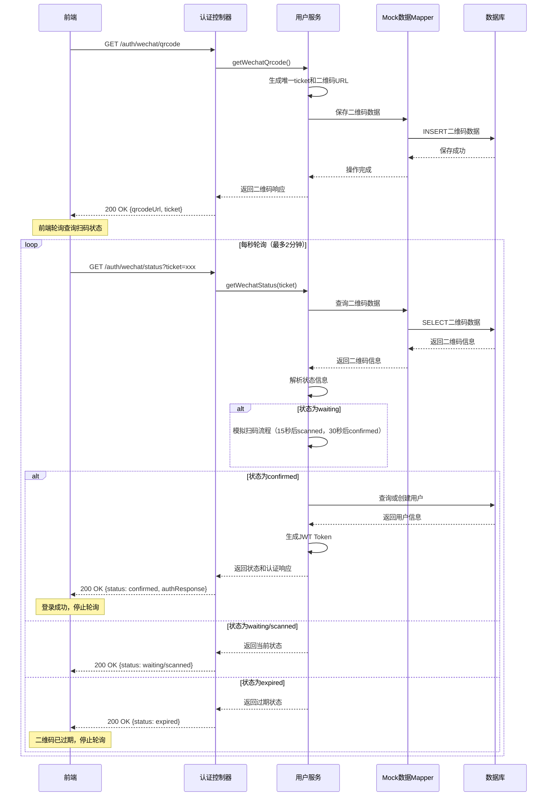
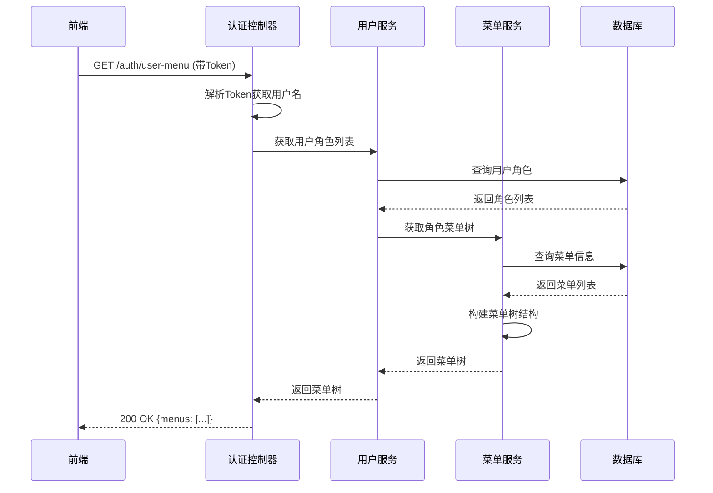

# 登录演示系统详细设计文档

## 1. 系统概述

本系统是一个基于Spring Boot和React的登录演示系统，实现了用户认证、权限管理、菜单管理等核心功能。系统采用前后端分离架构，支持JWT令牌认证、用户角色权限控制、菜单树动态生成等特性。

## 2. 技术栈

### 2.1 后端技术栈

| 技术/框架 | 版本 | 用途 |
|---------|------|------|
| Spring Boot | 2.x | 应用程序框架 |
| MyBatis-Plus | 3.x | ORM框架 |
| MySQL | 8.x | 关系型数据库 |
| Redis | 6.x | 缓存、Session存储、分布式锁 |
| JWT | - | 无状态认证 |
| Swagger | 2.9.2 | API文档 |
| Lombok | 1.18.16 | 减少样板代码 |

### 2.2 前端技术栈

| 技术/框架 | 版本 | 用途 |
|---------|------|------|
| React | 17.0.2 | UI库 |
| Ant Design | 4.16.13 | UI组件库 |
| React Router | - | 前端路由 |
| Axios | 0.24.0 | HTTP客户端 |

## 3. 数据库设计

### 3.1 数据库表结构

#### 3.1.1 `users`表 - 用户信息表

```sql
CREATE TABLE `users` (
  `id` bigint NOT NULL AUTO_INCREMENT,
  `username` varchar(50) NOT NULL COMMENT '用户名',
  `password` varchar(255) NOT NULL COMMENT '密码',
  `email` varchar(100) NOT NULL COMMENT '邮箱',
  `phone` varchar(20) DEFAULT NULL COMMENT '手机号',
  `nickname` varchar(50) DEFAULT NULL COMMENT '昵称',
  `avatar` varchar(255) DEFAULT NULL COMMENT '头像',
  `status` tinyint DEFAULT '1' COMMENT '状态 0:禁用 1:启用',
  `locked` tinyint DEFAULT '0' COMMENT '是否锁定 0:未锁定 1:锁定',
  `login_count` int DEFAULT '0' COMMENT '登录次数',
  `last_login_time` datetime DEFAULT NULL COMMENT '最后登录时间',
  `last_login_ip` varchar(50) DEFAULT NULL COMMENT '最后登录IP',
  `create_time` datetime DEFAULT CURRENT_TIMESTAMP COMMENT '创建时间',
  `update_time` datetime DEFAULT CURRENT_TIMESTAMP ON UPDATE CURRENT_TIMESTAMP COMMENT '更新时间',
  PRIMARY KEY (`id`),
  UNIQUE KEY `idx_username` (`username`),
  UNIQUE KEY `idx_email` (`email`),
  UNIQUE KEY `idx_phone` (`phone`)
) ENGINE=InnoDB AUTO_INCREMENT=2 DEFAULT CHARSET=utf8mb4 COLLATE=utf8mb4_0900_ai_ci;
```

#### 3.1.2 `roles`表 - 角色信息表

```sql
CREATE TABLE `roles` (
  `id` bigint NOT NULL AUTO_INCREMENT,
  `name` varchar(50) NOT NULL COMMENT '角色名称',
  `code` varchar(50) NOT NULL COMMENT '角色编码',
  `description` varchar(255) DEFAULT NULL COMMENT '角色描述',
  `status` tinyint DEFAULT '1' COMMENT '状态 0:禁用 1:启用',
  `create_time` datetime DEFAULT CURRENT_TIMESTAMP COMMENT '创建时间',
  `update_time` datetime DEFAULT CURRENT_TIMESTAMP ON UPDATE CURRENT_TIMESTAMP COMMENT '更新时间',
  PRIMARY KEY (`id`),
  UNIQUE KEY `idx_role_code` (`code`)
) ENGINE=InnoDB DEFAULT CHARSET=utf8mb4 COLLATE=utf8mb4_0900_ai_ci;
```

#### 3.1.3 `user_roles`表 - 用户角色关联表

```sql
CREATE TABLE `user_roles` (
  `id` bigint NOT NULL AUTO_INCREMENT,
  `user_id` bigint NOT NULL COMMENT '用户ID',
  `role_id` bigint NOT NULL COMMENT '角色ID',
  PRIMARY KEY (`id`),
  KEY `idx_user_id` (`user_id`),
  KEY `idx_role_id` (`role_id`)
) ENGINE=InnoDB DEFAULT CHARSET=utf8mb4 COLLATE=utf8mb4_0900_ai_ci;
```

#### 3.1.4 `menus`表 - 菜单信息表

```sql
CREATE TABLE `menus` (
  `id` bigint NOT NULL AUTO_INCREMENT,
  `parent_id` bigint DEFAULT '0' COMMENT '父菜单ID',
  `name` varchar(100) NOT NULL COMMENT '菜单名称',
  `path` varchar(255) DEFAULT NULL COMMENT '菜单路径',
  `component` varchar(255) DEFAULT NULL COMMENT '组件路径',
  `key` varchar(100) NOT NULL COMMENT '菜单唯一标识',
  `type` tinyint NOT NULL COMMENT '菜单类型 0:目录 1:菜单 2:按钮',
  `icon` varchar(50) DEFAULT NULL COMMENT '菜单图标',
  `sort_order` int DEFAULT '0' COMMENT '排序号',
  `hidden` tinyint DEFAULT '0' COMMENT '是否隐藏 0:显示 1:隐藏',
  `status` tinyint DEFAULT '1' COMMENT '状态 0:禁用 1:启用',
  `create_time` datetime DEFAULT CURRENT_TIMESTAMP COMMENT '创建时间',
  `update_time` datetime DEFAULT CURRENT_TIMESTAMP ON UPDATE CURRENT_TIMESTAMP COMMENT '更新时间',
  PRIMARY KEY (`id`),
  KEY `idx_parent_id` (`parent_id`),
  KEY `idx_sort_order` (`sort_order`)
) ENGINE=InnoDB DEFAULT CHARSET=utf8mb4 COLLATE=utf8mb4_0900_ai_ci;
```

#### 3.1.5 `role_menus`表 - 角色菜单关联表

```sql
CREATE TABLE `role_menus` (
  `id` bigint NOT NULL AUTO_INCREMENT,
  `role_id` bigint NOT NULL COMMENT '角色ID',
  `menu_id` bigint NOT NULL COMMENT '菜单ID',
  PRIMARY KEY (`id`),
  KEY `idx_role_id` (`role_id`),
  KEY `idx_menu_id` (`menu_id`)
) ENGINE=InnoDB DEFAULT CHARSET=utf8mb4 COLLATE=utf8mb4_0900_ai_ci;
```

#### 3.1.6 `mock_data`表 - Mock挡板数据表

```sql
CREATE TABLE `mock_data` (
  `id` bigint NOT NULL AUTO_INCREMENT COMMENT '主键ID',
  `data_type` varchar(50) NOT NULL COMMENT '数据类型：sms_code-短信验证码, wechat_qrcode-微信二维码',
  `data_key` varchar(255) NOT NULL COMMENT '数据键：手机号或ticket',
  `data_value` varchar(500) COMMENT '数据值：验证码或二维码URL',
  `extra_data` text COMMENT '额外数据：JSON格式存储额外信息',
  `status` varchar(20) DEFAULT 'active' COMMENT '状态：active-有效, expired-过期, used-已使用',
  `expire_time` datetime COMMENT '过期时间',
  `created_at` datetime NOT NULL DEFAULT CURRENT_TIMESTAMP COMMENT '创建时间',
  `updated_at` datetime NOT NULL DEFAULT CURRENT_TIMESTAMP ON UPDATE CURRENT_TIMESTAMP COMMENT '更新时间',
  PRIMARY KEY (`id`),
  INDEX `idx_data_type_key` (`data_type`, `data_key`),
  INDEX `idx_status` (`status`),
  INDEX `idx_expire_time` (`expire_time`)
) ENGINE=InnoDB DEFAULT CHARSET=utf8mb4 COMMENT='Mock挡板数据表';
```

**用途说明**：
- 存储短信验证码：`data_type='sms_code'`，`data_key`为手机号，`data_value`为6位验证码，有效期5分钟
- 存储微信登录二维码：`data_type='wechat_qrcode'`，`data_key`为ticket，`data_value`为二维码URL，`extra_data`存储状态信息，有效期2分钟

## 4. 系统架构

### 4.1 整体架构

- **前端**: React + Ant Design + React Router
- **后端**: Spring Boot + MyBatis-Plus
- **数据层**: MySQL + Redis
- **认证**: JWT Token

### 4.2 核心流程图

#### 4.2.1 登录流程



#### 4.2.2 手机验证码登录流程



#### 4.2.3 微信扫码登录流程



#### 4.2.4 菜单获取流程



## 5. 后端功能设计

### 5.1 核心模块

#### 5.1.1 认证模块 (AuthController)

**主要功能**：处理用户认证相关请求，包括注册、登录、获取用户菜单、登出和刷新Token。

**关键接口**：
- `POST /auth/register` - 用户注册
- `POST /auth/login` - 用户登录（账号密码）
- `POST /auth/send-sms-code` - 发送手机验证码
- `POST /auth/login-by-phone` - 手机验证码登录
- `GET /auth/wechat/qrcode` - 获取微信登录二维码
- `GET /auth/wechat/status` - 查询微信扫码状态
- `GET /auth/user-menu` - 获取当前用户菜单
- `POST /auth/logout` - 用户登出
- `POST /auth/refresh` - 刷新访问令牌
- `GET /auth/validate` - 验证Token有效性

#### 5.1.2 用户模块 (UserController, UserServiceImpl)

**主要功能**：用户信息管理、用户认证逻辑实现。

**核心方法**：
- `register(RegisterRequest)` - 用户注册逻辑
- `login(LoginRequest)` - 用户登录逻辑，包含密码验证、Token生成、登录失败限制
- `sendSmsCode(String)` - 发送手机验证码，生成6位随机验证码并保存到mock_data表，有效期5分钟，1分钟内防重复发送
- `loginByPhone(String, String)` - 手机验证码登录，验证验证码有效性和正确性，成功后生成Token
- `getWechatQrcode()` - 获取微信登录二维码，生成唯一ticket和二维码URL，保存到mock_data表
- `getWechatStatus(String)` - 查询微信扫码状态，轮询检查扫码和确认状态，支持模拟扫码流程
- `logout(String)` - 用户登出，将Token加入黑名单
- `getUserMenus(String)` - 获取用户可访问的菜单列表
- `checkUserLocked(String)` - 检查用户是否锁定
- `updatePassword(Long, String)` - 更新用户密码，包含密码加密和数据库更新

**关键接口**：
- `PUT /users/{id}/password` - 更新用户密码，接收新密码参数，返回操作结果

#### 5.1.3 菜单模块 (MenuController, MenuServiceImpl)

**主要功能**：菜单管理、菜单树构建。

**核心方法**：
- `listAllMenus()` - 获取所有菜单
- `listMenusByRoleIds(List<Long>)` - 根据角色ID列表获取菜单
- `getUserMenuTree(List<Long>)` - 获取用户菜单树
- `buildMenuTree(List<Menu>)` - 构建菜单树结构
- `addChildMenus(Menu, Map<Long, List<Menu>>)` - 递归添加子菜单

### 5.2 DTO类设计

#### 5.2.1 认证相关DTO

- `SmsCodeRequest` - 发送短信验证码请求DTO，包含手机号字段及格式验证
- `PhoneLoginRequest` - 手机验证码登录请求DTO，包含手机号和验证码字段
- `WechatQrcodeResponse` - 微信二维码响应DTO，包含二维码URL、ticket和过期时间
- `WechatStatusResponse` - 微信扫码状态响应DTO，包含状态信息和认证响应（确认后返回）

### 5.3 工具类

#### 5.3.1 JwtUtils

**主要功能**：JWT令牌的生成、解析和验证。

#### 5.3.2 PasswordUtils

**主要功能**：密码的加密和验证。

#### 5.3.3 RedisUtils

**主要功能**：Redis操作工具类，用于缓存管理、分布式锁等。

### 5.4 Mock数据管理

#### 5.4.1 MockData实体类

**主要功能**：Mock挡板数据的实体映射，支持存储短信验证码和微信登录二维码数据。

**关键字段**：
- `dataType` - 数据类型标识（sms_code/wechat_qrcode）
- `dataKey` - 数据键（手机号或ticket）
- `dataValue` - 数据值（验证码或二维码URL）
- `extraData` - JSON格式的额外数据（微信状态信息）
- `status` - 状态（active/expired/used）
- `expireTime` - 过期时间

#### 5.4.2 MockDataMapper

**主要功能**：Mock数据的数据库操作接口，支持按类型和键查询、状态更新、过期数据清理等功能。

## 6. 前端功能设计

### 6.1 核心页面

#### 6.1.1 登录页面 (LoginPage.js)

**主要功能**：支持多种登录方式的用户登录页面，包括账号密码登录、手机验证码登录和微信扫码登录。

**核心功能点**：
- **三种登录方式切换**：使用Ant Design Tabs组件实现账号密码、手机验证码、微信扫码三种登录方式的切换
- **账号密码登录**：
  - 登录表单验证
  - 自动填充默认测试账号
  - 记住我功能
- **手机验证码登录**：
  - 手机号格式验证（11位，1开头）
  - 发送验证码按钮，支持60秒倒计时
  - 验证码输入框（6位数字）
  - 验证码验证后登录
- **微信扫码登录**：
  - 自动获取二维码（切换到微信登录标签时）
  - 二维码展示（200x200px）
  - 状态轮询（每秒检查扫码状态，最多2分钟）
  - 状态提示：等待扫码、已扫描（等待确认）、已过期、登录成功
  - 二维码过期后支持刷新
- **通用功能**：
  - 登录状态管理
  - Token存储
  - 错误处理和提示
  - 自动登录功能（页面刷新时）

#### 6.1.2 主页面 (MainPage.js)

**主要功能**：系统主界面，包含侧边栏菜单、顶部导航、内容区域。

**核心功能点**：
- 动态菜单加载
- 菜单树构建
- 页面路由切换
- 用户信息展示

#### 6.1.3 用户管理页面 (UsersListPage.js)

**主要功能**：用户列表展示、用户管理操作，包括添加、编辑、删除用户，配置用户角色，以及设置用户密码。

**核心功能点**：
- 用户列表展示与搜索过滤
- 用户信息编辑与保存
- 用户角色配置
- 用户密码设置功能
  - 密码设置弹窗，支持新密码输入
  - 密码长度验证（至少6个字符）
  - 两次密码输入一致性校验
  - 密码更新结果反馈
- 用户删除确认与操作

#### 6.1.4 角色管理页面 (RolesListPage.js)

**主要功能**：角色列表展示、角色权限配置。

#### 6.1.5 菜单管理页面 (MenusListPage.js)

**主要功能**：菜单树展示、菜单增删改查。

### 6.2 全局配置

#### 6.2.1 Axios配置 (App.js)

**主要功能**：配置HTTP请求拦截器，处理Token添加、响应错误处理等。

**核心配置**：
- 基础URL设置
- 请求拦截器：添加Authorization头
- 响应拦截器：处理Token过期、统一错误处理

#### 6.2.2 路由配置

**主要功能**：定义系统路由结构，实现页面导航。

**路由列表**：
- `/login` - 登录页
- `/register` - 注册页
- `/` - 主页 (默认重定向到dashboard)
- 其他业务路由 (动态加载)

## 7. 安全设计

### 7.1 认证安全

- JWT令牌认证，支持访问令牌和刷新令牌
- Token过期机制，自动刷新Token
- 登录失败次数限制，超过阈值自动锁定用户
- Token黑名单机制，登出后立即失效
- **手机验证码安全**：
  - 验证码6位随机数字，有效期5分钟
  - 1分钟内防重复发送，防止验证码轰炸
  - 验证码验证后立即标记为已使用，防止重复使用
  - 验证码存储在数据库中，支持过期自动清理
- **微信扫码登录安全**：
  - 二维码唯一ticket机制，防止重放攻击
  - 二维码有效期2分钟，过期后自动失效
  - 状态轮询机制，实时更新扫码状态
  - 支持模拟扫码流程（演示环境）

### 7.2 数据安全

- 密码加密存储 (bcrypt)
- 敏感信息传输加密 (HTTPS)
- SQL注入防护 (MyBatis-Plus参数化查询)

## 8. 部署配置

### 8.1 后端配置 (application.yml)

**主要配置项**：
- 服务器端口
- 数据库连接信息
- Redis配置
- JWT配置 (密钥、过期时间)
- 登录失败限制配置

### 8.2 前端配置 (package.json)

**主要配置项**：
- 依赖管理
- 开发服务器配置
- 代理配置

## 9. 新增功能说明

### 9.1 手机验证码登录功能

**功能概述**：用户可以通过手机号接收验证码的方式进行登录，无需记忆密码。

**技术实现**：
- 后端生成6位随机验证码，保存到`mock_data`表
- 验证码有效期5分钟，1分钟内防重复发送
- 前端实现60秒倒计时，防止频繁请求
- 验证码验证成功后立即标记为已使用

**接口说明**：
- `POST /auth/send-sms-code` - 发送验证码，需要手机号参数
- `POST /auth/login-by-phone` - 手机验证码登录，需要手机号和验证码参数

**安全机制**：
- 手机号格式验证（11位，1开头）
- 验证码有效期控制
- 防重复使用机制
- 发送频率限制

### 9.2 微信扫码登录功能

**功能概述**：用户可以通过微信扫码的方式进行登录，提升用户体验。

**技术实现**：
- 后端生成唯一ticket和二维码URL，保存到`mock_data`表
- 二维码有效期2分钟
- 前端实现状态轮询，每秒检查扫码状态
- 支持模拟扫码流程（演示环境）：15秒后显示"已扫描"，30秒后自动确认登录

**接口说明**：
- `GET /auth/wechat/qrcode` - 获取微信登录二维码，返回二维码URL和ticket
- `GET /auth/wechat/status?ticket=xxx` - 查询微信扫码状态，返回状态信息和认证响应（确认后）

**状态流转**：
- `waiting` - 等待扫码
- `scanned` - 已扫描，等待用户确认
- `confirmed` - 已确认，返回认证Token
- `expired` - 二维码已过期

**前端实现**：
- 自动获取二维码（切换到微信登录标签时）
- 状态轮询机制（每秒检查，最多120次）
- 状态提示和UI反馈
- 过期后支持刷新二维码

### 9.3 Mock挡板数据管理

**设计目的**：在开发和测试环境中，使用Mock数据表存储验证码和二维码信息，避免依赖第三方服务（短信服务、微信开放平台）。

**表结构设计**：
- `data_type` - 数据类型标识（sms_code/wechat_qrcode）
- `data_key` - 数据键（手机号或ticket）
- `data_value` - 数据值（验证码或二维码URL）
- `extra_data` - JSON格式的额外数据（用于存储微信状态信息）
- `status` - 状态管理（active/expired/used）
- `expire_time` - 过期时间控制

**数据清理**：
- 支持按过期时间自动清理过期数据
- 验证码使用后立即标记为已使用
- 二维码过期后标记为过期状态

## 10. 总结

本系统是一个基于Spring Boot和React的前后端分离登录演示系统，实现了完整的用户认证、权限管理、菜单管理功能。系统采用JWT无状态认证，支持用户角色权限控制，菜单树动态生成等特性。通过MySQL存储业务数据，Redis缓存临时数据，保证了系统的性能和安全性。

**最新更新**：系统新增了手机验证码登录和微信扫码登录两种登录方式，丰富了用户认证体验。通过Mock挡板数据表的设计，实现了验证码和二维码信息的统一管理，便于开发和测试环境的快速迭代。

系统架构清晰，模块划分合理，代码结构规范，便于维护和扩展。详细设计文档覆盖了数据库设计、前端页面、后端功能和技术栈使用情况，包括新增的手机验证码登录、微信扫码登录功能，可以作为系统开发和维护的重要参考。